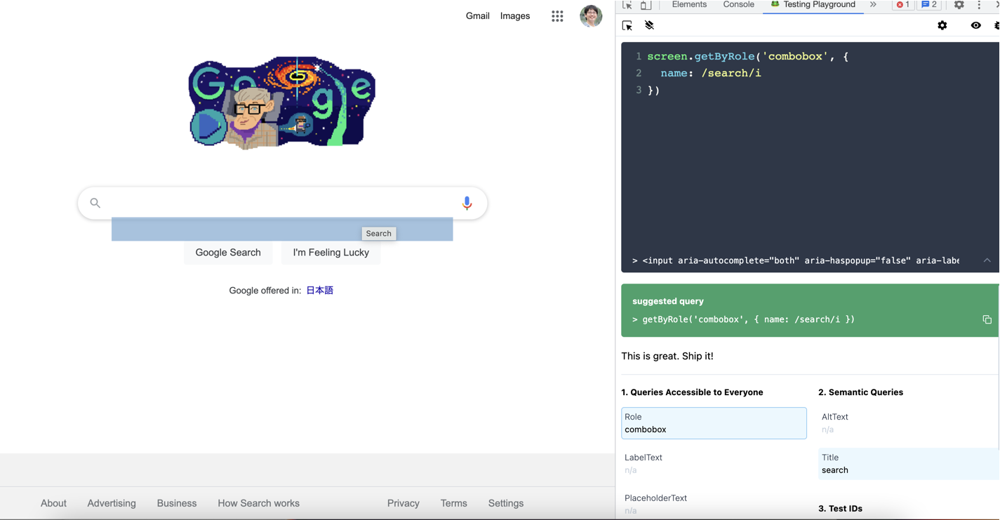
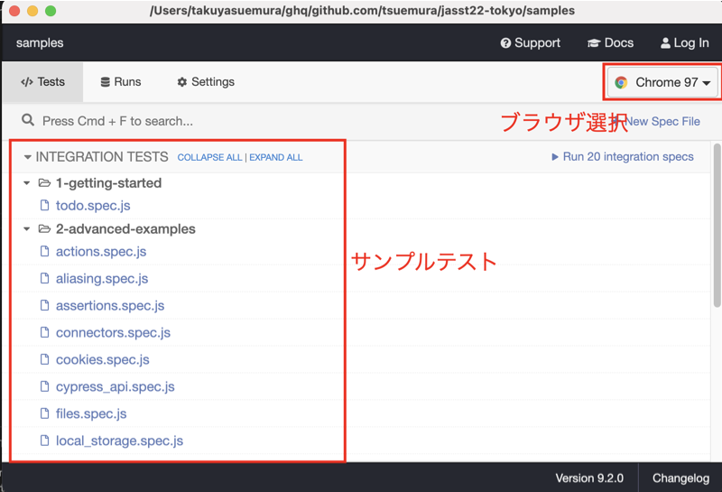
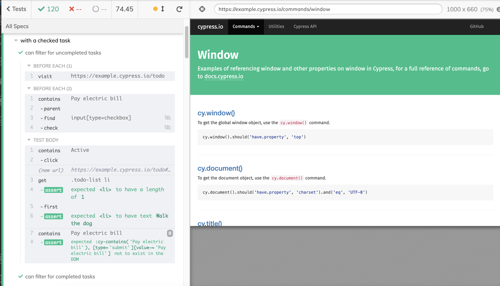
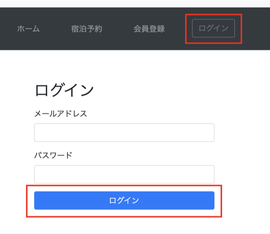
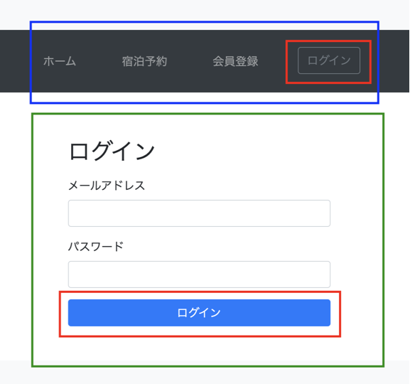

# 60分で学ぶ実践E2Eテスト

2022/3/10 JaSST`22 Tokyo

末村拓也(Autify)・伊藤由貴(ベリサーブ)

---

## TODO:導入部分

- 想定内容
  - セッションの概要説明
  - 自己紹介
  - 前提条件（SUTなど）
  - E2Eとは

---

<!-- 1 -->
# 設計編

---

<!-- 2 -->
## 導入：皆さんに質問

「E2Eテストを自動化しよう」と思った場合、何から始めますか？

- 思いつくままに自動化する
- 今ある手動テストを順番に自動化する
- 大事そうなテストケースから自動化する

---

<!-- 3 -->
アンチパターンです

---

<!-- 4 -->
## 本パートの概要

- やみくもにE2Eテストを自動化するのは危険
- 何をテストするのか、どこから自動化するのかを考える必要がある
  - この考え方を説明

※正確には「何をテストするのか」はJSTQBで言うところの「テスト分析」が相当。

---

<!-- 5 -->
## やみくもにE2Eテストを自動化するデメリット

- 自動テストが増え、メンテナンスが辛くなる
- 自動テストが増え、実行時間（期間）が延びる
- 実行しても不具合を見つけられないテストが増える

などなど

---

<!-- 6 -->
## 何をテストするか、を考える際のポイント

- 単体テストや結合テストなど、自組織の各テストがどんな役割を担っているか
  - その中でE2Eテストでは何を担保したいか
- 理想とする開発サイクル
  - リリース頻度、CI/CDパイプライン、テストにかけられる時間、など

---

## テストレベルごとの役割

- テストピラミッドにおいては、Unit, API, UIの3層
  - 日本で一般には「単体テスト」「結合テスト」「システムテスト」のような区分で呼ばれる
  - 組織によって呼び名は様々
- 自分たちが「E2Eテスト」と呼ぶテストでは何を担保したいのか、を決める

---

## 例：組織ごとに定義されたテストレベルと範囲

- 単体テスト
  - プロダクトコード中の各メソッドのふるまいをテストする
  - カバレッジは＊＊%必須、例外についても全て確認、等を目指す
- 結合テスト
  - コンポーネント間の呼び出しやデータの受け渡しなどをテストする
- E2Eテスト
  - システムのふるまいをテストする
  - 実際にユーザが行える操作を元にテスト

---

## 一般的にE2Eテストとして自動化されるもの

- ユーザへの影響度が高い機能やユーザシナリオ
  - 起動/終了、ログイン/ログアウト、課金・購入、など
- ビジネス上の影響度が高い機能やユーザシナリオ
  - 会員登録、メルマガなど

などを、複雑な異常系や多数のデータパターンではなく正常系を中心に実行することが多い

---


---

## TODO：Testing vs Checking

自動テストはチェッキング寄りなので、「バグをたくさん見つけよう」的発想のテストケースを自動化するとじわじわ辛いですよ、あたりを説明

---


## TODO：アジャイルテストの４象限


---


## TODO:実際にE2Eテストとして自動化する内容を考える

- Hotel Planisphereの場合、架空の条件として
  - UnitTestとAPITestは行われている
  - 各テストはCI/CDパイプラインに載っており、E2Eテストはリリースの手前で実施される
  - Productionへのデプロイは手動


---

# 60分で学ぶ実践E2Eテスト（実装編）

---

# はじめに

---

## E2Eテストコード、書いてますか？

---

## 何に困ってますか？

- 書きたいと思ってるんだけど、ググるといろんなやり方が出てきて、どれが良いやり方なのかわからない
- 昔チャレンジしたんだけど、メンテナンスが上手く行かなかった
- 勉強する時間がない、正解を教えてほしい

---

## 今日話すこと

時間もあんまり無いので、 **個人的ベストプラクティス** にフォーカスしてお伝えします

- 爆速でセットアップしてテストコードを書き始める方法
- 最近流行ってるライブラリ
- 可読性の高いテストコードの書き方
- サクッと運用に載せていく方法

---

# 利用するライブラリ

---

## Cypress

デベロッパーフレンドリーなE2Eテストツール

- Chrome/Firefoxに対応
- テストコードの作成やデバッグを楽にする機能がいろいろある

---
<!--
## testing-library

「ユーザーと同じ目線でテストコードを書きたい」という思想から生まれたライブラリ

アクセシビリティのためのAPIを使ってテストを書ける


```html
<header>
    <h1>Awesome webpage</h1>
</header>
```

```js
getByRole('banner', 'Awesome webpage')
```

---

## testing-playground


https://chrome.google.com/webstore/detail/testing-playground/hejbmebodbijjdhflfknehhcgaklhano

testing-libraryのクエリを調べるための Chrome Extension



---

-->

## インストール

NodeJSのインストールが必要です

Macの場合は以下

```bash
$ brew install node
```

---

## インストール

```bash
$ mkdir jasst22tokyo
$ cd jasst22tokyo
$ npm install cypress @testing-library/cypress
```

---

## 起動

```bash
$ npx cypress open
```

初回起動時に設定ファイルとサンプルのテストコードが生成されます

---



---



テストを実行すると実行結果が細かく表示されます

---

# ステップ1: Cypress Studio でテストコードを自動記録する

---

## Cypress Studio とは

- テストコードを自動記録するためのツール
- テスト結果から続けてテストコードを追記してくれる

---

## テスト対象

Hotel Planisphere

https://hotel.testplanisphere.dev/ja/

- 自動テスト用のサンプルサイト
- （人によっては）親の顔より見たと思う

---

## テストシナリオ

- https://hotel.testplanisphere.dev/ja/index.html にアクセスする
- `ログイン` をクリックする
- `メールアドレス` に `ichiro@example.com` と入力する
- `パスワード` に `password` と入力する
- `ログイン` をクリックする

---

## まずはテストを書く土台を作っていく

`integration` フォルダ内に `login.js` を作り、以下のように記述する

```js
describe('Login', () => {
  it('as a premium member', () => {
    cy.visit("https://hotel.testplanisphere.dev/ja/index.html");
    // ここから先は自動記録でやってもらう
  })
})
```

---

## Cypressを起動する

```bash
$ npx cypress open
```

---

## 自動記録する


---

```js
describe('Login', () => {
  it('as a premium member', () => {
    cy.visit("https://hotel.testplanisphere.dev/ja/index.html");
    /* ==== Generated with Cypress Studio ==== */
    cy.get('#login-holder > .btn').click();
    cy.get('#email').clear();
    cy.get('#email').type('ichiro@example.com');
    cy.get('#password').clear();
    cy.get('#password').type('password');
    cy.get('#login-button').click();
    /* ==== End Cypress Studio ==== */
  })
})
```

---

## ちょっと読みにくいので加工しましょう

コメントアウトされている箇所は消しても大丈夫

```js
describe('Login', () => {
  it('as a premium member', () => {
    cy.visit("https://hotel.testplanisphere.dev/ja/index.html");
    /* ==== Generated with Cypress Studio ==== */
    cy.get('#login-holder > .btn').click();
    // cy.get('#email').clear();
    cy.get('#email').type('ichiro@example.com');
    // cy.get('#password').clear();
    cy.get('#password').type('password');
    cy.get('#login-button').click();
    /* ==== End Cypress Studio ==== */
  })
})
```

---

# ステップ2: コードを読みやすくする

---

- https://hotel.testplanisphere.dev/ja/index.html にアクセスする
- `ログイン` をクリックする
- `メールアドレス` に `ichiro@example.com` と入力する
- `パスワード` に `password` と入力する
- `ログイン` をクリックする


```js
describe('Login', () => {
  it('as a premium member', () => {
    cy.visit("https://hotel.testplanisphere.dev/ja/index.html");
    cy.get('#login-holder >  .btn').click();
    cy.get('#email').type('ichiro@example.com');
    cy.get('#password').type('password');
    cy.get('#login-button').click();
  })
})
```

❌ 元のシナリオとテストコードの対応が取れていない

---

## 理想はこう書きたい

```js
describe('Login', () => {
  it('as a premium member', () => {
    cy.visit("https://hotel.testplanisphere.dev/ja/index.html");
    cy.get('ログイン').click();
    cy.get('メールアドレス').type('ichiro@example.com');
    cy.get('パスワード').type('password');
    cy.get('ログイン').click();
  })
})
```

---

## cy.contains() を使う

- https://hotel.testplanisphere.dev/ja/index.html にアクセスする
- `ログイン` をクリックする
- `メールアドレス` に `ichiro@example.com` と入力する
- `パスワード` に `password` と入力する
- `ログイン` をクリックする

```js
describe('Login', () => {
  it('as a premium member', () => {
    cy.visit("https://hotel.testplanisphere.dev/ja/index.html");
    cy.contains('ログイン').click();
    cy.contains('メールアドレス').type('ichiro@example.com')
    cy.contains('パスワード').type('password')
    cy.contains('ログイン').click();
  })
})
```

元のシナリオと同じ書き方に出来た

---

## あいまいな部分を排除する

よく見ると「ログイン」というボタンが2つありますね



---

## 構造に着目しましょう



ユーザーはナビゲーションバーとフォームの「ログイン」ボタンを使い分けているはず

要素選択も同じようにします

---

## `within()` を使う

```js
describe('Login', () => {
  it('as a premium member', () => {
    cy.visit("https://hotel.testplanisphere.dev/ja/index.html");

    // ナビゲーションバーの中の要素を操作
    cy.get('nav').within(() => {
      cy.contains('ログイン').click();
    })

    // フォームの中の要素を操作
    cy.get('form').within(() => {
      cy.contains('メールアドレス').type('ichiro@example.com')
      cy.contains('パスワード').type('password')
      cy.contains('ログイン').click();
    })
  })
})
```

---


